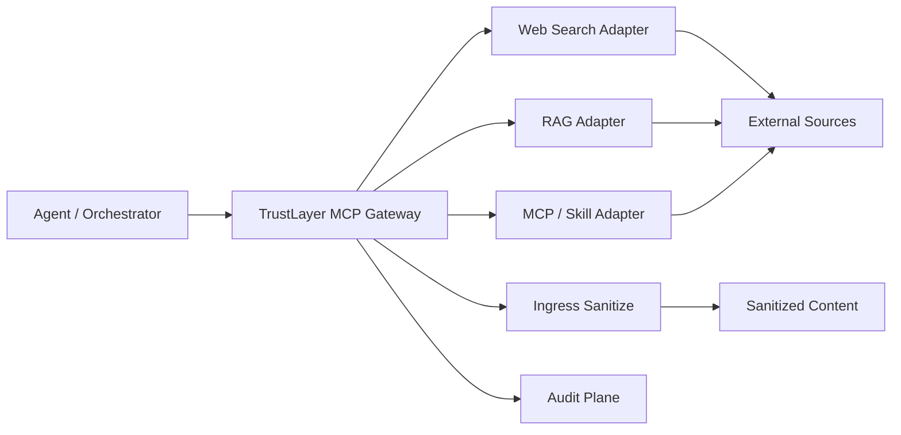

# 模块 11：MCP Gateway

更新时间：2026-04-20

## 模块防御目标

这一层要解决的问题是：

**如果外部输入本来就是通过 MCP / skill / connector 进入 Agent，那能不能把入口治理前移到“取数据的那一跳”。**

它的目标不是完整实现 MCP 协议栈，而是先证明一件事：

- Agent 不必直连外部输入源
- TrustLayer 可以作为统一输入入口
- Gateway 拉回结果后，可以立刻复用已有 `sanitize_ingress`
- 这一层自身也能写入审计链

## 架构图



这张图最想表达的是：

**TrustLayer 不只是“输入已经取回来之后再清洗”，还可以前移成一个统一取数入口。**

## 设计思路

当前实现刻意保持最小：

1. 用 `MCPGatewayService` 做统一编排
2. 用 `CallableMCPToolAdapter` 注册可被代理的外部工具
3. 每次 `fetch` 都先记录 `mcp_tool_invoked`
4. 工具返回结果后记录 `mcp_tool_result`
5. 再把结果交给已有 `sanitize_ingress`

这样做的好处是：

- 不用先引入完整 MCP server/client 依赖
- 先把“统一入口 + 输入治理 + 审计链”这条产品主线跑通
- 以后要接真 MCP，也可以沿这个服务边界往外替换

## 关键代码示例

核心服务在
[mcp_gateway.py](../src/trustlayer/mcp_gateway.py)：

```python
class MCPGatewayService:
    def fetch_tool(self, *, tenant_id: str, session_id: str, tool_name: str, arguments: dict[str, Any]) -> dict[str, Any]:
        tool = self._tools.get(tool_name)
        ...
        tool_result = tool.fetch(arguments)
        sanitized = self.defense.sanitize_ingress(
            tenant_id=tenant_id,
            session_id=session_id,
            source_type=tool_result.source_type,
            origin=tool_result.origin,
            content=tool_result.content,
        )
        return {...}
```

HTTP 接口在
[app.py](../src/trustlayer/app.py)：

```python
if method == "GET" and path == "/v1/mcp/tools":
    ...

if method == "POST" and path == "/v1/mcp/tools/fetch":
    ...
```

## 当前接口

- `GET /v1/mcp/tools`
- `POST /v1/mcp/tools/fetch`

`fetch` 请求体最小字段：

- `tenant_id`
- `session_id`
- `tool_name`
- `arguments`

## 验证测试设计

当前 MCP Gateway 相关测试先覆盖三件事：

1. 工具列表能正确暴露
2. `fetch` 后会自动经过 sanitize，并写入审计事件
3. 未知工具会返回显式错误，而不是静默失败

对应测试在：
[test_gateway.py](../tests/test_gateway.py)

## 测试过程记录

当前新增验证点包括：

- `test_mcp_gateway_lists_registered_tools`
- `test_mcp_gateway_fetch_sanitizes_tool_output_and_records_mcp_audit_events`
- `test_mcp_gateway_returns_unknown_tool_error`

## 当前价值

这一版 MCP Gateway 已经能证明：

- TrustLayer 可以从“显式 sanitize API”往“统一取数入口”演进
- 输入治理可以前移到工具获取层
- 审计不只记录输入进入，还能记录“是谁拉来的”

## 当前限制

- 还不是完整 MCP 协议兼容层
- 当前工具注册还是进程内 adapter，不是远程 MCP 发现
- 还没有做工具级权限、版本和供应链治理
- 也还不能覆盖所有非 MCP 输入

## 下一步演进

1. 增加远程 MCP server 代理能力
2. 为每个工具增加 trust tier 和 source policy
3. 增加工具级 allowlist / denylist
4. 把 MCP Gateway 接到更真实的 connector / search / RAG 实现
