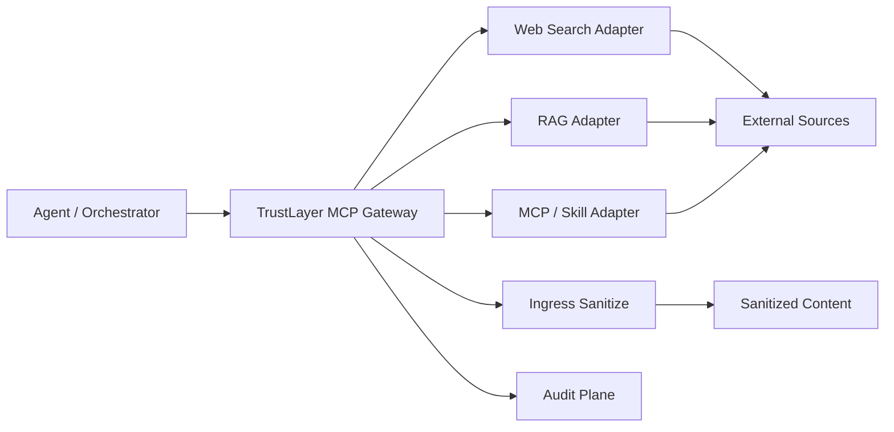

# 模块 11：MCP Gateway

更新时间：2026-04-20

## 模块防御目标

这一层要解决的问题是：

**如果外部输入本来就是通过 MCP / skill / connector 进入 Agent，那能不能把入口治理前移到“取数据的那一跳”。**

它的目标不是完整实现 MCP 协议栈，而是先证明一件事：

- Agent 不必直连外部输入源
- TrustLayer 可以作为统一输入入口
- Gateway 拉回结果后，可以立刻复用已有 `sanitize_ingress`
- 这一层自身也能写入审计链

## 架构图



这张图最想表达的是：

**TrustLayer 不只是“输入已经取回来之后再清洗”，还可以前移成一个统一取数入口。**

## 设计思路

当前实现刻意保持最小：

1. 用 `MCPGatewayService` 做统一编排
2. 用 `CallableMCPToolAdapter` 注册可被代理的外部工具
3. 默认提供一个 `RemoteWebFetchAdapter`
4. 默认提供一个 `RemoteJSONRAGAdapter`
5. 每次 `fetch` 都先记录 `mcp_tool_invoked`
6. 工具返回结果后记录 `mcp_tool_result`
7. 再把结果交给已有 `sanitize_ingress`

这样做的好处是：

- 不用先引入完整 MCP server/client 依赖
- 先把“统一入口 + 输入治理 + 审计链”这条产品主线跑通
- 以后要接真 MCP，也可以沿这个服务边界往外替换

## 关键代码示例

核心服务在
[mcp_gateway.py](../src/trustlayer/mcp_gateway.py)：

```python
class MCPGatewayService:
    def fetch_tool(self, *, tenant_id: str, session_id: str, tool_name: str, arguments: dict[str, Any]) -> dict[str, Any]:
        tool = self._tools.get(tool_name)
        ...
        tool_result = tool.fetch(arguments)
        sanitized = self.defense.sanitize_ingress(
            tenant_id=tenant_id,
            session_id=session_id,
            source_type=tool_result.source_type,
            origin=tool_result.origin,
            content=tool_result.content,
        )
        return {...}
```

默认远程网页 adapter：

```python
class RemoteWebFetchAdapter:
    def fetch(self, arguments: dict[str, Any]) -> MCPToolResult:
        url = str(arguments["url"])
        request = urllib.request.Request(
            url,
            headers={"User-Agent": "TrustLayer-MCP-Gateway/0.1"},
        )
        ...
```

默认远程 JSON RAG adapter：

```python
class RemoteJSONRAGAdapter:
    def fetch(self, arguments: dict[str, Any]) -> MCPToolResult:
        url = str(arguments["url"])
        ...
        payload = json.loads(body.decode(charset, errors="ignore"))
        extracted = payload.get(content_field, "")
        ...
        return MCPToolResult(source_type="rag_chunk", origin=url, content=content, metadata={...})
```

HTTP 接口在
[app.py](../src/trustlayer/app.py)：

```python
if method == "GET" and path == "/v1/mcp/tools":
    ...

if method == "POST" and path == "/v1/mcp/tools/fetch":
    ...
```

## 当前接口

- `GET /v1/mcp/tools`
- `POST /v1/mcp/tools/fetch`
- `POST /v1/mcp/invoke`

`fetch` 请求体最小字段：

- `tenant_id`
- `session_id`
- `tool_name`
- `arguments`

`invoke` 在当前版本里是更通用的统一入口，请求体最小字段是：

- `tenant_id`
- `session_id`
- `tool_name`
- `direction`
- `arguments`

## 验证测试设计

当前 MCP Gateway 相关测试先覆盖三件事：

1. 工具列表能正确暴露
2. `fetch` 后会自动经过 sanitize，并写入审计事件
3. 未知工具会返回显式错误，而不是静默失败
4. `remote_web_fetch` 可以通过真实 HTTP 获取链完成输入治理
5. `remote_rag_fetch` 可以通过真实 JSON connector 获取链完成输入治理

对应测试在：
[test_gateway.py](../tests/test_gateway.py)

## 测试过程记录

当前新增验证点包括：

- `test_mcp_gateway_lists_registered_tools`
- `test_mcp_gateway_fetch_sanitizes_tool_output_and_records_mcp_audit_events`
- `test_mcp_gateway_invoke_unifies_ingress_under_one_request_id`
- `test_mcp_gateway_invoke_routes_egress_tool_through_egress_pipeline`
- `test_mcp_gateway_returns_unknown_tool_error`
- `test_remote_web_fetch_adapter_sanitizes_live_http_source`
- `test_remote_rag_fetch_adapter_pulls_live_json_and_marks_risk_signals`

其中新增的统一 invoke 验证有两个关键点：

- `ingress` 工具现在可以走 `/v1/mcp/invoke`
- `egress` 工具现在也可以走 `/v1/mcp/invoke`
- 同一次工具调用下，`mcp_tool_invoked` 和后续 ingress / egress 决策事件会共用同一个 `request_id`

另外，remote 验证不是只喂一段本地字符串，而是：

- 启一个真实 HTTP fixture
- 用 `remote_web_fetch` 拉取页面
- 再验证隐藏内容是否被 `sanitize_ingress` 去掉
- 用 `remote_rag_fetch` 拉取远程 JSON 文档
- 再验证 `rag_chunk` 是否正常进入 sanitize 与审计链

另外，这版还实际跑过一条真正的 remote 验证：

- 地址：
  `https://raw.githubusercontent.com/zackerkoi/TrustLayer/main/fixtures/remote_hidden_supplier.html`
- 返回决策：
  `allow_sanitized`
- 风险标签：
  `external_origin + hidden_content`
- 时间线：
  `mcp_tool_invoked -> mcp_tool_result -> source_received -> policy_matched -> source_sanitized`

另外，这版还具备一个更像 connector / RAG 的真实 remote 输入验证：

- 地址：
  `https://raw.githubusercontent.com/zackerkoi/TrustLayer/main/fixtures/remote_rag_chunk.json`
- 入口工具：
  `remote_rag_fetch`
- 返回类型：
  `rag_chunk`
- 风险标签：
  `external_origin + oversized_text`
- 结果特征：
  远程 JSON 文档里的 `title / doc_id / content` 会被抽成统一 chunk，再进入现有入口治理；当前样例还会因为超长 chunk 被标记为 `oversized_text`

## 当前价值

这一版 MCP Gateway 已经能证明：

- TrustLayer 可以从“显式 sanitize API”往“统一取数入口”演进
- 输入治理可以前移到工具获取层
- 审计不只记录输入进入，还能记录“是谁拉来的”
- 入口层已经不只是 mock adapter，而是能跑真实 remote fetch
- 统一 broker 已经开始落地，ingress 和 egress 可以共用一个 invoke 入口
- 同一次工具调用已经能围绕共享 `request_id` 留下更完整的审计链

## 当前限制

- 还不是完整 MCP 协议兼容层
- 当前工具注册还是进程内 adapter，不是远程 MCP 发现
- 还没有做工具级权限、版本和供应链治理
- 也还不能覆盖所有非 MCP 输入

## 下一步演进

1. 增加远程 MCP server 代理能力
2. 为每个工具增加 trust tier 和 source policy
3. 增加工具级 allowlist / denylist
4. 把 MCP Gateway 接到更真实的 connector / search / RAG 实现
