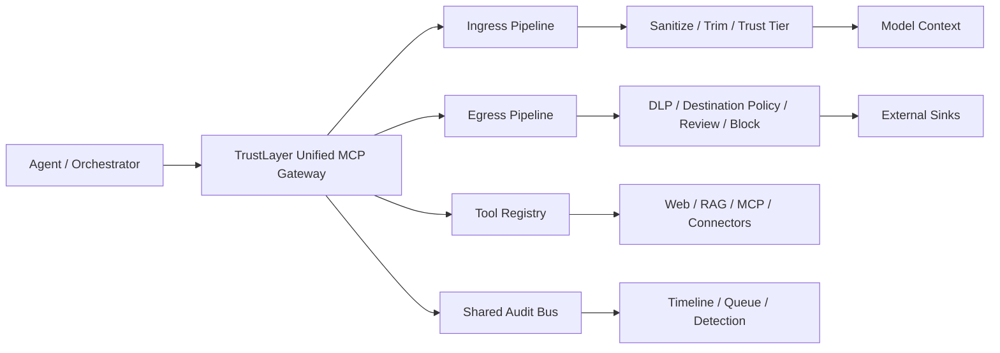

# 模块 14：Unified MCP Gateway

更新时间：2026-04-20

## 模块防御目标

这一版设计稿要回答的问题是：

**如果入口治理本质上是在 MCP / tool / connector 的取数边界上做，出口控制本质上也是在 MCP / tool / connector 的执行边界上做，那两者能不能合成一个统一控制面。**

我的判断是：

- 可以合并成一个统一底座
- 但不能把 ingress 和 egress 混成一套同质策略
- 更合理的形态是：**一个统一 MCP Gateway，内部拆成 ingress pipeline 和 egress pipeline**

它的目标不是把概念说圆，而是把未来的产品演进方向说清楚：

- Agent 只接一个 TrustLayer gateway
- 所有 tool / connector 调用都先经过统一 broker
- 输入和输出共用一套 registry、审计和策略控制面
- 但输入治理和输出控制仍然按不同防御目标独立决策

## 为什么值得统一

当前 TrustLayer 已经有两块能力：

- `MCP Gateway`
  负责把外部输入先收口，再进入 sanitize
- `Egress Gateway`
  负责在敏感数据外发前做 `allow / review / block`

它们虽然分处 kill chain 的不同位置，但其实都落在同一个工程边界上：

**Agent 想通过工具与外部世界交互的那个边界。**

如果继续沿着产品化方向演进，分成两个完全独立系统会有三个问题：

1. Agent 侧要接两次
2. 工具级权限、来源级信任和外发级目的地策略会分散
3. 审计链容易变成“入口一份日志，出口一份日志”，中间缺统一 tool identity

所以更合理的方向不是继续拆，而是：

**做一个 Unified MCP Gateway，再在内部把输入治理和输出控制分流。**

## 架构图



这张图最想表达的是：

**底座应该统一，但决策管线必须按 ingress 和 egress 分开。**

## 设计思路

如果往这个方向改代码，我会把当前产品重组为四个核心面：

1. `Tool Registry`
   统一描述工具元数据，而不是只注册一个 Python adapter。

2. `Ingress Pipeline`
   专门处理：
   - 来源分级
   - 内容净化
   - 超长裁剪
   - 不可信打标

3. `Egress Pipeline`
   专门处理：
   - 目的地治理
   - secret / PII 检测
   - review / block
   - 外发配额与异常模式

4. `Shared Audit Bus`
   不再分别记“输入日志”和“外发日志”，而是围绕同一个 tool invocation / tool result / tool egress 链路记事件。

这样做的关键不是少几个服务，而是得到一个更清晰的控制面：

- 同一个 connector 可以既有 ingress policy，也有 egress policy
- 同一个 session 下，输入和输出都挂在同一个 tool identity 上
- 后面做 tool 级权限、租户级 allowlist、供应链治理时，底层不需要重做

## 拟议的数据模型

统一之后，我建议每个 tool 至少描述这些字段：

```python
@dataclass
class ToolDescriptor:
    name: str
    direction: str  # ingress / egress / bidirectional
    trust_tier: str
    source_type: str | None = None
    destination_type: str | None = None
    allow_domains: tuple[str, ...] = ()
    review_required: bool = False
```

这里最重要的不是字段本身，而是：

**tool 不再只是“能不能调用”，而是“它在哪个方向调用、按什么策略调用”。**

## 拟议的统一接口

当前 TrustLayer 已有：

- `GET /v1/mcp/tools`
- `POST /v1/mcp/tools/fetch`
- `POST /v1/egress/check`

如果走统一网关，我更倾向于把接口收成两类：

1. `POST /v1/mcp/invoke`
   统一 tool 调用入口。

2. `GET /v1/mcp/tools`
   返回工具元数据、方向、策略摘要和可见性信息。

`invoke` 的最小请求体可以长成这样：

```json
{
  "tenant_id": "demo",
  "session_id": "sess-001",
  "tool_name": "remote_rag_fetch",
  "direction": "ingress",
  "arguments": {
    "url": "https://example.com/chunk.json"
  }
}
```

如果是外发型工具，则变成：

```json
{
  "tenant_id": "demo",
  "session_id": "sess-002",
  "tool_name": "webhook_post",
  "direction": "egress",
  "arguments": {
    "destination": "https://hooks.example.com/audit",
    "payload": "..."
  }
}
```

这里 `direction` 很关键，因为统一入口不等于统一策略。

## 为什么不建议把 ingress / egress 完全讲成同一个东西

虽然技术上它们都可以走 MCP Gateway，但安全语义完全不同。

### Ingress 的关注点

- 数据从哪来
- 能不能先净化
- 哪些内容只能当资料
- 如何减少进入上下文的暴露面

### Egress 的关注点

- 数据要发去哪
- 发出去的内容是什么
- 有没有敏感数据
- 是放行、审批还是阻断

所以更准确的产品表达应该是：

**TrustLayer 是一个 Unified MCP Gateway。**

其中：

- `Ingress Gateway` 是它的输入治理管线
- `Egress Gateway` 是它的输出控制管线
- `Audit Plane` 是它的独立控制面

## 对现有代码的重构建议

如果下一步真的改代码，我建议顺序是：

1. 保留现有 `MCPGatewayService`
   先把它升成统一 broker，而不是马上推翻重写。

2. 抽出 `ToolDescriptor`
   让当前 `RemoteWebFetchAdapter`、`RemoteJSONRAGAdapter` 带上方向和 trust tier。

3. 把 `egress_check` 包成一种 egress tool invocation
   先在网关层模拟 unified invoke，而不是先改掉所有底层逻辑。

4. 审计事件统一 tool identity
   让输入和输出事件都能围绕同一个 `tool_name`、`direction`、`session_id` 回放。

5. 最后再考虑 API 收口
   先做到内部统一，再决定要不要对外只暴露 `invoke`。

## 验证测试设计

这一版设计稿虽然还没进代码，但测试思路已经可以先定下来。

我会优先补四类验证：

1. `bidirectional registry`
   同一个 tool registry 能同时描述 ingress 和 egress 工具。

2. `direction-aware invoke`
   同样走统一 invoke，ingress 自动进入 sanitize，egress 自动进入 DLP / review / block。

3. `shared audit chain`
   同一个 session 下可以连续回放：
   - tool invoked
   - tool result
   - source sanitized
   - egress reviewed / blocked

4. `policy separation`
   证明 ingress 和 egress 虽然共用网关，但不会误用对方策略。

## 预期价值

如果 Unified MCP Gateway 做成，产品层面的好处会很直接：

- Agent 接入点从两个收成一个
- tool 治理从分散规则变成统一 registry
- 审计从“输入日志 + 外发日志”升级成完整 tool 生命周期
- 更容易继续长到插件治理、权限控制和供应链治理

## 当前边界

这份文档原本是设计稿，但现在前两步已经落进代码了：

- `ToolDescriptor` 已经进入 [mcp_gateway.py](../src/trustlayer/mcp_gateway.py)
- `/v1/mcp/tools` 现在会暴露 `direction / trust_tier / source_type / destination_type`
- `/v1/mcp/invoke` 已经可以统一调用 `ingress` 和 `egress` 工具
- 当前 `fetch` 仍然只允许 `ingress` 工具，作为兼容入口保留
- `egress` 工具已经能通过 unified invoke 进入 egress pipeline

也就是说，**统一底座和 unified invoke 都已经开始成形，但底层策略引擎还没有完全收口。**

当前 TrustLayer 仍然是：

- `MCP Gateway` 负责 ingress
- `Egress Gateway` 负责输出控制
- `Audit Plane` 负责独立留痕

所以这篇现在的价值是两层：

1. 解释为什么要统一
2. 记录“统一 registry，策略仍分流”第一步怎么落地
3. 记录“统一 invoke，共享 request_id 审计链”第二步怎么落地

它还不是在宣布“已经统一完成”，而是在明确：

**给下一阶段的代码和产品包装，先定一个更合理的演进方向。**

## 下一步演进

1. 继续把更多 egress 动作收进 unified broker
2. 让 `fetch` 逐步退成兼容入口，主路径转向 `invoke`
3. 统一更多 tool-level 审计字段和审批视图
4. 再决定是否把 HTTP 接口彻底收口到 `POST /v1/mcp/invoke`
