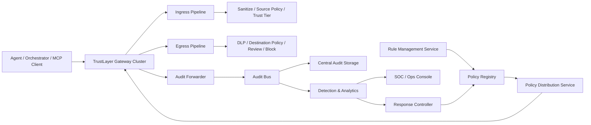
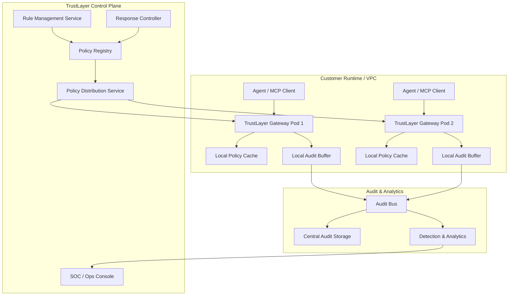
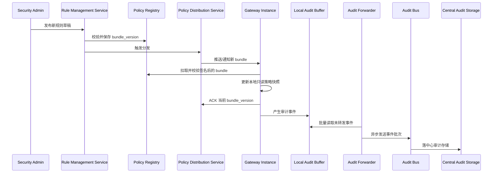
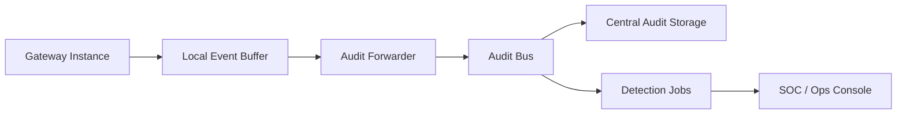

# 模块 16：生产级控制面架构

更新时间：2026-04-20

## 这份设计稿解决什么问题

当前 TrustLayer 的代码已经把规则从硬编码迁到了 SQLite 策略表里，但这仍然是单机 PoC 形态。

真正到了生产环境，安全负责人关心的不是“单个实例能不能拦住一条请求”，而是：

- 规则由谁维护
- 规则怎么发布
- 多个网关实例怎么拿到一致策略
- 审计日志怎么从执行节点回传
- 检测和报表怎么集中做
- 误报、漏报、例外和回滚怎么形成闭环

这份设计稿讲的就是这套更贴近实际生产的形态。

## 目标架构

TrustLayer 生产版我会拆成两面：

- **Control Plane**
  管理规则、版本、审批策略、租户配置、检测和运营
- **Data Plane**
  真正拦截和审计 Agent / MCP / tool / connector 流量

它们的关系有点像传统安全产品里的控制面和执行面：

- 控制面负责“发规则、看全局、做响应”
- 执行面负责“本地决策、快速拦截、稳定留痕”

## 总体架构图

## 生产部署图

## 规则分发与日志回传时序

## 组件拆分

### 1. Gateway Cluster

这是最靠近 Agent 的执行层。

每个实例负责：

- 接 ingress tool 调用
- 接 egress tool 调用
- 本地执行规则
- 本地生成审计事件
- 本地缓存策略快照

这里必须强调一点：

**执行面不能依赖每次请求都去控制面查规则。**

原因很简单：

- 延迟太高
- 控制面出故障会拖垮执行面
- 请求量一上来会放大依赖

生产上更合理的方式是：

- 执行面持有本地只读策略快照
- 规则更新由控制面异步分发
- 每个请求都在本地完成决策

### 2. Rule Management Service

这是规则管理系统，不是简单的数据库表。

它至少要负责：

- 规则定义和编辑
- 规则校验
- 规则版本管理
- 租户级覆盖
- 灰度发布
- 回滚
- 变更审计

这里我不会让安全团队直接去改原始 SQL 或 JSON。

更像生产的形态应该是：

- UI / API 写入规则草稿
- 后端做 schema 校验和语义校验
- 生成不可变版本
- 通过发布系统分发给执行面

### 3. Policy Registry

这是规则事实源。

建议至少存这些对象：

- `policy_bundle`
  一次完整发布的规则包
- `tenant_policy_binding`
  哪个租户当前绑定哪个版本
- `rule_change`
  谁在什么时候改了什么
- `policy_exception`
  临时例外、过期时间、审批记录
- `distribution_status`
  每个网关实例当前拉到了哪个版本

如果是生产实现，我会更倾向：

- 元数据放 PostgreSQL
- 规则包放对象存储或版本仓库
- 执行面只拉已签名的 bundle

而不是让每个执行节点都直接查中心数据库。

当前代码也已经沿这个方向走了一步：

- 本地执行面策略仍然落在本机 SQLite
- 控制面元数据存储已经支持 `SQLite 开发 / PostgreSQL 生产` 双路径

### 4. Policy Distribution Service

这块非常关键，但很容易被忽略。

规则管理系统写好了，不代表执行层就安全了。中间还需要一条可靠分发链路。

它至少要做：

- 规则包打包
- 版本号生成
- 签名和校验
- 全量 / 增量分发
- 分租户分批灰度
- ACK 回执
- 分发失败告警

一个更贴近生产的流程会是：

1. 规则在 Rule Management Service 中通过校验
2. 生成 `bundle_version`
3. 分发服务推送或供网关拉取
4. 网关下载 bundle
5. 本地校验签名
6. 热更新到本地只读缓存
7. 回报当前版本和加载状态

### 5. Audit Forwarder

执行面本地会先写一份审计事件，但生产上不能只留在本地。

所以每个网关实例需要一个 Audit Forwarder，负责把事件旁路送回中心。

它做的事包括：

- 从本地事件缓冲读取
- 批量打包
- 补实例和版本元数据
- 异步发送到日志总线
- 失败重试
- 背压控制

这里推荐旁路异步，而不是主链同步上报。

因为同步上报会让“审计后端抖一下”变成“拦截链路跟着抖一下”。

### 6. Audit Bus

这层是日志回传主干。

生产里更合理的选型通常是：

- Kafka / Pulsar / Kinesis 这种消息总线

它解决的问题是：

- 多实例并发写入
- 审计后端和检测后端解耦
- 回放和重算
- 多消费者并行处理

这里的审计事件不该再是 PoC 里的“本地 SQLite 记录一下就算了”，而应该变成标准事件流。

### 7. Central Audit Storage

集中审计存储负责：

- 长期留存
- 按 session / request / tenant 检索
- 调查回放
- 法务和合规留档
- 检测结果回灌

更接近生产的做法通常是分层：

- 热数据放 Elasticsearch / ClickHouse / OLAP
- 冷数据放对象存储

而不是把所有东西继续压在执行节点的本地文件里。

### 8. Detection & Analytics

这块不能再只是本地 CLI 报表。

生产里应该独立运行的至少有三类分析：

1. **规则分析**
   看哪条规则命中最多、哪条规则误报最多
2. **异常检测**
   看新域名激增、review 激增、同类 session 漂移
3. **运营分析**
   看误报率、漏报率、审批积压、租户覆盖率

这里我会坚持一个原则：

**检测链路独立于执行链路。**

执行面负责快速决策，检测面负责慢一些但更全面的分析。

### 9. Response Controller

生产系统里，告警如果只停在“看到异常”，价值会被打折很多。

Response Controller 至少要支持：

- 提高某租户审批等级
- 暂停某类 egress tool
- 熔断某个 connector
- 下发临时黑名单
- 回滚到上一个稳定规则版本

这类动作应该由独立控制器触发，不应该让被攻击的 Agent 自己决定“要不要停”。

## 规则对象设计

生产版的规则对象建议拆成四层。

### 1. Global Baseline

全局基础规则：

- 默认 secret 检测
- 默认 PII 检测
- 默认输入来源分级
- 默认审批优先级

### 2. Tenant Policy

租户级覆盖：

- 允许域名
- 特殊目的地
- 业务线自定义 connector
- 特定例外

### 3. Runtime Exception

临时例外：

- 某租户临时放行一个域名
- 某场景临时放宽 payload 阈值
- 设过期时间和审批单号

### 4. Response Override

应急覆盖：

- 短时间内强制 block 某类 egress
- 暂时拉高 review 等级
- 快速关停某个高风险 tool

这样分层以后，规则管理才能同时满足：

- 稳定基线
- 租户差异
- 临时业务例外
- 应急响应

## 规则发布流程

我建议规则发布流程至少分成这几步：

1. 编写或修改规则草稿
2. 静态校验
3. 回归测试
4. 在 shadow tenant 或小流量实例灰度
5. 发布新版本
6. 观察命中率和误报率
7. 全量放开或回滚

这里最容易被忽略的是第 3 和第 4 步。

真正生产可用的系统，不该让一条未经验证的新正则直接打到所有租户和所有实例上。

## 日志事件设计

生产里建议把事件 schema 固定下来。

最少要有：

- `tenant_id`
- `session_id`
- `request_id`
- `instance_id`
- `gateway_version`
- `policy_bundle_version`
- `tool_name`
- `direction`
- `event_type`
- `decision`
- `policy_ids`
- `risk_flags`
- `destination_host`
- `source_type`
- `created_at`

这样将来你才能回答：

- 哪个实例当时跑的是什么规则版本
- 某次误报到底是哪个 bundle 引入的
- 某个租户是否因为规则分发失败，跑在旧版本上

## 日志回传链路

审计日志回传我会设计成：

几个关键点：

- 本地先写缓冲，防止进程崩了日志全丢
- Forwarder 异步发，避免影响主决策链
- Bus 做解耦和削峰
- 检测和存储分消费者处理

## 指标体系

生产版指标我会分四层看。

### 1. 执行面健康指标

- 网关实例 QPS
- 决策延迟
- 策略加载成功率
- 当前策略版本分布
- Audit Forwarder 积压量

### 2. 防御效果指标

- `block` 数量
- `review_required` 数量
- 高风险 flag 命中趋势
- 新域名访问趋势
- 每租户高风险工具命中趋势

### 3. 质量指标

- 误报率
- 漏报率
- 规则回滚次数
- 灰度失败次数

### 4. 运营效率指标

- 审批处理时长
- 例外申请数量
- 从 case 到规则修复的耗时
- 分发失败恢复时间

## 故障和降级设计

生产架构里一定要提前定义这些场景：

### 1. 控制面不可用

网关继续用本地最近一次成功加载的策略快照工作。

### 2. 日志总线不可用

网关本地缓冲继续堆积，超过阈值开始告警，但不直接影响主链路。

### 3. 分发失败

控制面要能看见哪些实例还在旧版本，必要时阻止全量切换。

### 4. 新规则导致误报激增

Response Controller 可以快速回滚到上一个稳定 bundle。

## 和当前 PoC 的关系

当前代码可以看成这套生产架构里的一个最小雏形：

- `DefenseGatewayService`
  对应执行面决策引擎
- `PolicyStore`
  对应策略存储的最小形态
- `AuditStore`
  对应本地事件缓冲的最小形态
- `ops_report`
  对应集中分析的极简替身

但它还没有这些真正生产需要的部分：

- 中心规则管理系统
- 规则分发服务
- 集中日志总线
- 集中审计存储
- 独立检测服务
- 响应控制器

## 下一步演进顺序

如果真要按生产路线走，我会建议按这个顺序推进：

1. 先把规则中心做出来
2. 再做规则版本和分发
3. 然后做本地缓冲 + 审计回传
4. 再做集中检测和运营控制台
5. 最后才做自动响应和大规模多租户治理

这个顺序的好处是，先把“规则到底怎么管”这件事做稳，再去扩分发和检测，不容易把系统做成一堆能发日志但没人敢改规则的组件。
